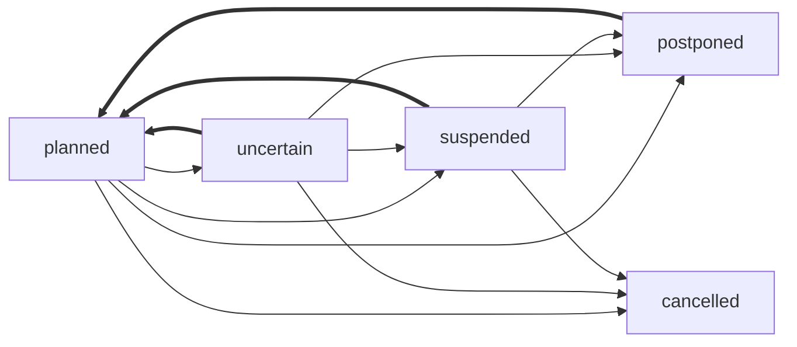

🔙 [@evnt Project](../README.md)

**Evnt Specification**

This document defines the data structures and types used for [Evnt](https://evnt.directory).

The main data structure is [`EventData`](#eventdata), which represents a single event. Event data should be represented as a JSON object.

See [Changelog](./CHANGELOG.md) for recent changes to the data format.

- [Types](#types)
	- [`Translations`](#translations)
	- [`PartialDate`](#partialdate)
	- [`EventStatus`](#eventstatus)
	- [`Media`](#media)
		- [`MediaSource`](#mediasource)
- [`EventData`](#eventdata)
	- [Venues](#venues)
		- [`Venue`](#venue)
		- [`PhysicalVenue`](#physicalvenue)
		- [`OnlineVenue`](#onlinevenue)
		- [`UnknownVenue`](#unknownvenue)
	- [Instances](#instances)
		- [`EventInstance`](#eventinstance)
	- [Components](#components)
		- [Type `EventComponent`](#type-eventcomponent)
		- [`LinkComponent`](#linkcomponent)
		- [`SourceComponent`](#sourcecomponent)
		- [`SplashMediaComponent`](#splashmediacomponent)

# Types

## `Translations`

`Translations` are defined as a json object where the keys are **BCP47/IETF language tag** and values are `string` values.


```ts
interface Translations {
	[language: string]: string;
}
```

```js
{
	en: "Example",
	tr: "Örnek",
	lt: "Pavyzdys",
	"zn-Hans-CN": "示例",
}
```

Data consumers should try to use the user's language in the object and fall back (`undefined | ""`) to other values.

When creating or editing event data, applications;

- **should not** use machine translation to fill in missing translations, but rather leave them empty and let users fill them in manually. Applications can use machine translations when displaying event details to users if they want to, but they should not modify the original data with machine translations.

- should try to omit regional variants of languages when possible and just use the main language code (e.g. `en` instead of `en-US` or `en-GB`) unless the regional variant is necessary to distinguish between different languages (e.g. `zh-Hans-CN` vs `zh-Hant-TW`).

## `PartialDate`

A `PartialDate` is defined as a **modified** [ISO 8601](https://en.wikipedia.org/wiki/ISO_8601) date and time string. The value does **not** include a timezone component and all values are **forced** to be in the **UTC timezone**.

This type allows us to define dates where we dont know enough information to define a full date. An event might be known to take place on April but the exact day might be unknown.

Atleast the year must be specified.

In order, the following components are allowed:
- Year (e.g. `2025`)
- Month (e.g. `2025-11`)
- Day (e.g. `2025-11-12`)
- Time (e.g. `2025-11-12T11:00`)

Examples:
- `2025`
- `2025-11`
- `2025-11-12`
- `2025-11-12T11:00`
- `2021-11-03T00:00`

⚠️ **Invalid** examples:
- `2025-11T12:00` (missing day)
- `2025-11-12T11:00Z` (includes timezone component)
- `2025-11-12T11:00+02:00` (includes timezone component)
- `2025-11-12T11:00:00` (includes seconds component)
- `2025-11-12T11` (missing minutes component)
- `2025-11-12T11:00:00.000` (includes milliseconds component)

## `EventStatus`

The `EventStatus` enum defines the possible schedule/planning state of an event instance or the whole event. This enum does not define the tense of the event (past, present, future) but rather the current state of the event planning or execution.

_Table of variants_:

| Variant     | Description                                                                           | Date Validity |
|-------------|---------------------------------------------------------------------------------------|---------------|
| `planned`   | Default state - event is planned to occur or has occurred as scheduled.               | ✅             |
| `uncertain` | Uncertain - event might get cancelled, postponed etc.                                 | ❓             |
| `postponed` | Postponed to a later, unknown date.                                                   | ❌             |
| `cancelled` | The event has been cancelled and will not take place.                                 | ❌             |
| `suspended` | No guarantees if the event will continue as planned, will get postponed or cancelled. | ❌             |

_Hellish Graph_:



## `Media`

A `Media` object represents a media item, such as an image or video.

Required fields:
- `sources`: An array of [`MediaSource`](#mediasource)s.

Optional fields:
- `alt`: [`Translations`](#translations) representing alternative text for the media, which can be used for accessibility.
- `presentation`: Optional object for presentation information;
  - `blurhash`: [BlurHash](https://blurha.sh/)
  - `dominantColor`: Hex color code with hashtag representing the dominant color; example: `#ff0000` for red.

```ts
let media: Media = {
	sources: [
		{
			url: "https://www.example.com/image.jpg",
			mimeType: "image/jpeg",
			dimensions: { width: 800, height: 600 },
		},
	],
	alt: {
		en: "An example image",
	},
	presentation: {
		blurhash: "LEHV6nWB2yk8pyo0adR*.7kCMdnj",
		dominantColor: "#ff0000",
	},
};
```

### `MediaSource`

A `MediaSource` represents a source of a media item, such as an image or video.

Required fields:
- `url`: The URL of the media source.

Optional fields:
- `mimeType`: The MIME type of the media source, such as `image/jpeg`, `video/mp4` etc.
- `dimensions`: Optional object with `width` and `height` properties representing the dimensions of the media in pixels.

# `EventData`

The main data structure representing an event is `EventData`.

```ts
{
	"v": 0,
	name: {
		en: "Example Event",
		lt: "Pavyzdys Renginys",
	},
}
```

Important fields:
- `v`: The version of the data format. Currently `0`. Required.
- `name`: [`Translations`](#translations); Required. The name of the event.

- `venues`: Array of [`Venue`](#venue)s.
- `instances`: Array of [`EventInstance`](#eventinstance)s.
- `components`: Array of [`EventComponent`](#eventcomponent)s.

Consumers should not use `venues` to display a list of venues for an event, but rather use the `venueIds` field in `EventInstance` objects to link them together (`Venue` has a `id` field). This allows us to:
- Represent instances where we dont know the venue of an event instance (empty `venueIds` array).
- Represent instances where an event takes place in multiple venues simultaneously or is a hybrid event (multiple `venueIds`).
- Avoid displaying venues that are not relevant to a specific event instance.

- **Venues** represent **where** an event takes place.
- **Instances** represent **when** an event takes place.
- **Components** represent **additional information** (not tied to a specific venue or instance) about an event.

The smallest valid event data object is: `{ v: 0, name: {} }`.

See the [schema documentation](./SCHEMA.md#event-data-schema) for the full definition.

## Venues

### `Venue`

A `Venue` represents a location where an event takes place.

All venues have the following properties:
- `id`: A **unique** identifier for the venue. This is used to link the venue to `EventInstance` objects.
- `type`: The type of the venue, either `physical`, `online` or `unknown`.
- `name`: The name of the venue as a [`Translations`](#translations) object.

Types of venues:
- [`PhysicalVenue`](#physicalvenue): A real-world location where an event takes place.
- [`OnlineVenue`](#onlinevenue): An online location where an event takes place, such as a website or streaming platform.
- [`UnknownVenue`](#unknownvenue): None of the above

### `PhysicalVenue`

A [`PhysicalVenue`](./SCHEMA.md#physicalvenue) represents a real-world location where an event takes place.

This object includes:
- `address`: Optional physical address information.
- `coordinates`: Optional latitude and longitude coordinates.

_Examples_:

```ts
let venue: PhysicalVenue = {
	id: "venue-1",
	type: "physical",
	name: { en: "Central Park", es: "Parque Central" },
	address: {
		addr: "Central Park West & 5th Ave, New York, NY 10024, USA",
		countryCode: "US",
	},
	coordinates: { lat: 40.785091, lng: -73.968285 },
}
```

### `OnlineVenue`

An [`OnlineVenue`](./SCHEMA.md#onlinevenue) represents an online location where an event takes place, such as a website or streaming platform.

This object includes:
- `url`: The URL where the event can be accessed.

_Examples_:

```ts
let venue: OnlineVenue = {
	id: "venue-2",
	type: "online",
	name: { en: "YouTube Live" },
	url: "https://www.youtube.com/live/example",
}
```

### `UnknownVenue`

An `UnknownVenue` represents a venue that is not known if it is online or physical.

This is primarily intended to be used for data scrapers when they know that an event has a venue but they cannot determine any information about it. This allows them to still link the event instance to a venue without having to provide any additional information.

## Instances

### `EventInstance`

An `EventInstance` represents a specific continuous occurrence of an event.

If an event has multiple occurrences (e.g., a conference with multiple days), each occurrence should be represented as a separate `EventInstance`.

If an event spans multiple days (such as a Game Jam or a Festival longer than 24 hours), it should be represented as a single `EventInstance` with a start and end date.

Required fields:
- `venueIds`: An array of strings linking this instance to one or more `Venue` objects. This field can be an empty array if the venue is not known.

Optional fields:
- `start`: A [`PartialDate`](#partialdate) representing the start date and/or time of the event instance
- `end`: A [`PartialDate`](#partialdate) representing the end date and/or time of the event instance
- `status`: An [`EventStatus`](#eventstatus) representing the current status of the event instance

_Examples_:

```ts
let instance: EventInstance = {
	venueIds: ["venue-1"],
	start: "2025-11-12T10:00",
	end: "2025-11-12T18:00",
}

let event: EventData = {
	v: 0,
	name: { en: "Example Event" },
	venues: [
		{
			// Note! This ID is used to link the venue to the event instance
			id: "venue-1",
			type: "unknown",
			name: { en: "Example Venue" },
		},
	],
	instances: [
		instance,
	],
}
```

## Components

### Type `EventComponent`

An `EventComponent` represents additional information about an event that is not tied to a specific venue or instance. This can be used to represent links, sources or any other relevant information about an event.

Each component has a `type` field that defines the type of the component and a `data` field that contains the relevant data for that type.

Table of defined component types:

| `type`        | `data` type                                   |
|---------------|-----------------------------------------------|
| `link`        | [LinkComponent](#linkcomponent)               |
| `source`      | [SourceComponent](#sourcecomponent)           |
| `splashMedia` | [SplashMediaComponent](#splashmediacomponent) |

Note that this list is **not exhaustive** and applications can define their own component types as needed. The only requirement is that the `type` field should be a string and the `data` field should atleast be an object.

⚠️ It is **strongly** recommended to prefix custom component types with the application name or a unique identifier to avoid conflicts with other applications (e.g. `myapp:customComponent`). If you define something with a generic name and coincidentally the specification later defines a component with the same name, it can cause conflicts and issues with data compatibility.

```ts
let component: EventComponent = {
	type: "link",
	data: {
		url: "https://www.example.com",
		name: { en: "Example Website" },
		description: { en: "The official website of the event" },
	},
}
```

### `LinkComponent`

A `LinkComponent` represents a link related to the event, such as a website, social media page, ticketing page etc.

Required fields:
- `url`: The URL of the link.

Optional fields:
- `name`: [`Translations`](#translations) representing the name of the link.
- ~~`description`: [`Translations`](#translations) representing a description of the link.~~ ⚠️ Might change
- `disabled`: A boolean indicating whether the link is disabled. This can be used to represent links that are no longer valid or temporarily unavailable.
- `opensAt`: A [`PartialDate`](#partialdate) representing the date and/or time when the link becomes active or valid. This can be used for links that are not yet active but will become active in the future (e.g., a ticketing page that opens at a specific date and time).
- `closesAt`: A [`PartialDate`](#partialdate) representing the date and/or time when the link becomes inactive or invalid. This can be used for links that are only valid for a certain period of time (e.g., a form for registering to a competition that closes at a specific date and time).

### `SourceComponent`

A `SourceComponent` represents a source of information about the event, such as a news article, a social media post, an official announcement etc.

Required fields:
- `url`: The URL of the source.

```ts
let link: LinkComponent = {
	url: "https://www.example.com/event-registration-form",
	name: { en: "Event Registration Form" },
	closesAt: "2025-10-01T23:59",
}
```

### `SplashMediaComponent`

A `SplashMediaComponent` represents a media item (such as an image or video) that can be used as a splash media for the event.

Splash media is a media item that can be used to represent the event in a visual way, such as a cover image or a promotional video. This can be used by applications to display a visually appealing representation of the event.

Required fields:
- `media`: A [`Media`](#media) object representing the media item.
- `roles`: A string array representing the roles of the splash media. This can be used to differentiate between different types of splash media (e.g., `background`, `thumbnail`, `poster` etc.) and allow applications to choose the most appropriate media item for a specific context. The only currently defined role is `background`, but applications can define their own roles as needed.
